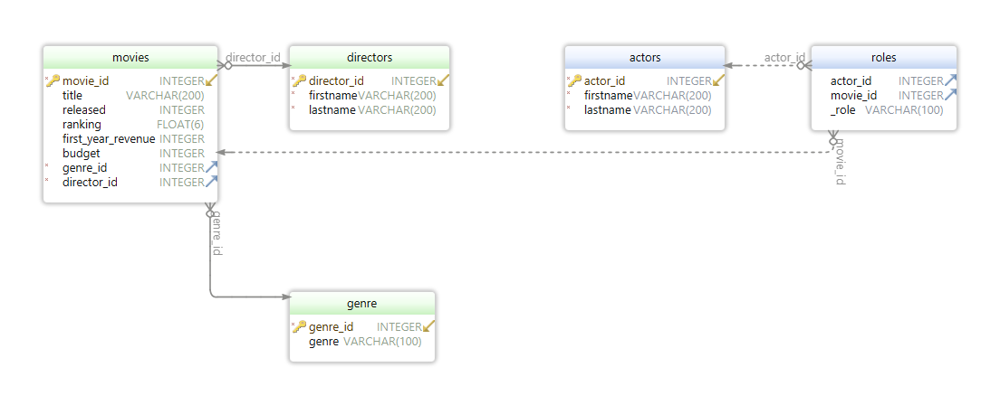

Öffne die zur Verfügung gestellte Datenbank.
Alle Aufgaben können dort ausgeführt werden.

Die Abgabe soll für jede Aufgabe die folgenden Information beinhalten:

- das vollständige Statement 
- die Anzahl an Zeilen die das statement zurückgibt/betrifft

Jede Aufgabe gibt genau Null oder Einen Punkt.
Es werden keine "Zwischenpunkte" vergeben.

Ein entsprechendes Programm für den Zugriff auf sqlite Datenbank wird bereitgestellt.

# Schema

Das DB Schema schaut wie folgt aus:



# Aufgaben

## Aufgabe 1

Welche Filme sind im Jahr 1994 erschienen?

```sql
select * 
from Movies m
where m.released = 1994

-- 4 rows
```

## Aufgabe 2

Gib den Vor- und Nachnamen der Schauspieler mit der Id 2753, 5871 und 11822 aus.

```sql
select firstname, lastname
from actors
where actor_id in (2753, 5871, 11822);

-- 3 rows
-- Skippy	Adelman
-- Kevin	Albridge
-- Richard (I)	Anderson
```

## Aufgabe 3

Finde alle Filme mit einem Budget größer oder gleich 1 Million USD und kleiner als 2 Millionen USD.
Sortiere das Ergebnis absteigend nach Erscheinungsjahr.

```sql
select * 
from movies 
where budget >= 1000000 and budget < 2000000 
order by released desc

-- 7 rows
```

## Aufgabe 4

Bei welchen Filmen hat der Regisseur "Stanley" "Kubrick" Regie geführt.
Gib die Titel der Filme und deren Id aus.

```sql
select m.movie_id, m.title 
from movies m 
    inner join directors d on m.director_id = d.director_id
where d.firstname = 'Stanley' and d.lastname = 'Kubrick'

-- 16 rows
```

## Aufgabe 5

Finde die Vor- und Nachnamen von Schauspielern die in einer Komödie (genre = "Comedy") mitgespielt haben.
Schauspieler die in mehreren Komödien mitgespielt haben sollen nicht mehrfach vorkommen.
Sortiere das Ergebnis nach Nachnamen und Vornamen.

```sql
select distinct a.firstname, a.lastname 
from actors as a 
    inner join roles r on a.actor_id = r.actor_id
    inner join movies m on r.movie_id = m.movie_id
    inner join genre g on g.genre_id = m.genre_id and g.genre = 'Comedy'
order by 2, 1

-- 91 rows
```

## Aufgabe 6

Welche Regisseur haben 1994 bei keinem Film Regie geführt.
Gib dabei alle spalten der Tabelle "directors" zurück.

```sql
select *
from directors d
    left join movies m on d.director_id = m.director_id and m.released = 1994
where m.movie_id is null

-- oder

select d.*
from directors d
except
    select d.*
    from directors d
        inner join movies m on d.director_id = m.director_id
    where m.released = 1994

-- 3 rows
```

## Aufgabe 7

Finde heraus wie viele Filme jeder Regisseur laut dem gegebenen Datenset gedreht hat.
Beachte, dass die Liste der Filme nicht vollständig ist, Regisseure ohne Filme sollen trotzdem im Ergebnis erscheinen (zb fehlen in diesem Datenset die Filme von Peter Jackson).

Die Anzahl der gedrehten Filme soll "Anzahl_Filme" heißen.

```sql
select d.director_id, d.firstname, d.lastname, count(m.movie_id) as Anzahl_Filme
from directors d
    left join movies m on m.director_id = d.director_id 
group by 1, 2, 3
order by 4

-- 5 rows
-- 41481	George	Lucas	0
-- 52418	Peter	Jackson	0
-- 78273	Quentin	Tarantino	9
-- 11652	James (I)	Cameron	14
-- 43095	Stanley	Kubrick	16
```

## Aufgabe 8

Liste die Erstjahreseinkünfte pro Regisseur (Summe der Einkünfte aller seiner Filme) und sortiere absteigend nach Einkünften.
Die Spalte mit den Gesamteinkünften soll "total" heißen.

```sql
select d.director_id, d.firstname, d.lastname, sum(m.first_year_revenue) as total
from directors d
    inner join movies m on d.director_id = m.director_id
group by 1, 2, 3
order by 1 desc

-- 3 rows
-- 78273	Quentin	Tarantino	256496
-- 43095	Stanley	Kubrick	400002
-- 11652	James (I)	Cameron	368902
```

## Aufgabe 9

Liste die Top 5 Filme mit dem höchsten Gewinn im ersten Jahr.
Gib den Titel und den Gewinn im ersten Jahr aus (muss aus Umsatz/revenue und Budget berechnet werden).
Das Ergebnis soll maximal 5 Zeilen haben.

```sql
select m.title, m.first_year_revenue - m.budget as profit_first_year
from movies m
order by 2 desc
limit 5

-- 5 rows
-- Piranha Part Two: The Spawning	49640
-- Kill Bill: Vol. 2	48132
-- Four Rooms	17085
-- Dark Angel	15767
-- Barry Lyndon	6281
```

## Aufgabe 10

Was ist das Durchschnittliche Budget eines Films bei dem "Chris" "Anastasio" mitgespielt hat.

```sql
select avg(m.budget) as avg_budget
from actors as a 
    inner join roles r on r.actor_id = a.actor_id
    inner join movies m on m.movie_id = r.movie_id
where a.firstname = 'Chris' and a.lastname = 'Anastasio'

-- 1 row
-- 39170
```

## Aufgabe 11

Wie viele Filme haben das wort "the" im Titel

```sql
select count(*) as count
from movies as m
where m.title like "%the%"

-- 1 row
-- 10
```

## Aufgabe 12

In Welchem Jahr sind 2 oder mehr Komödien (genre = "Comedy") erschienen.

```sql
select released, count(*) as count
from movies as m
    inner join genre g on g.genre_id = m.genre_id
where m.genre_id = 4
group by released
having count >= 2

-- 1 row
-- 1994	2
```

## Aufgabe 13

Ändere das Ranking aller Komödien (genre = "Comedy") die 1994 und 1995 gedreht wurden.
Das neue Ranking soll um 1 höher sein als das alte.

```sql
update movies
set ranking = ranking + 1
where released in(1994, 1995) and genre_id = 4

-- 3 rows affected
```

## Aufgabe 14

Erstelle eine neue Tabelle "best_director_awards" mit den 2 Spalten "director_id" und "movie_id" (Kombinierter Primärschlüssel).
Die Spalten sollen auch mit Fremdschlüsseln auf die anderen Tabellen verweisen.

```sql
drop table if exists best_director_awards;

create table best_director_awards(
    director_id INT(10) NOT NULL,
    movie_id INT(10) NOT NULL,
    primary key (director_id, movie_id),
    foreign Key (director_id) references directors(director_id),
    foreign Key (movie_id) references movies(movie_id)
);
```

## Aufgabe 15

Befülle die Tabelle "best_director_awards" mit den folgenden Daten:

| director_id | movie_id |
| :---------- | -------- |
| 11652       | 333856   |
| 43095       | 92616    |
| 43095       | 1711     |
| 43095       | 65764    |
| 43095       | 30431    |
| 78273       | 267038   |
| 78273       | 159665   |

```sql
insert into best_director_awards 
values
    (11652, 333856), -- James Cameron	Titanic
    (43095, 92616), -- Stanley Kubrick	Dr. Strangelove
    (43095, 1711), -- Stanley Kubrick	2001: A Space Odyssey
    (43095, 65764), -- Stanley Kubrick	A Clockwork Orange
    (43095, 30431), -- Stanley Kubrick	Barry Lyndon
    (78273, 267038), -- Quentin Tarantino	Pulp Fiction
    (78273, 159665); -- Quentin Tarantino	Inglourious Basterds

-- 7 rows affected
```

## Aufgabe 16

Liste alle Genres und die Anzahl der Filme bei denen ein Best Director Award vergeben wurde.
Sortiere das Ergebnis absteigend nach der Anzahl an Auszeichnungen.
Bei gleicher Anzahl soll alphabetisch nach Namen sortiert werden.

Genres bei denen keine Auszeichnungen gespeichert sind sollen mit der Anzahl 0 aufscheinen.

```sql
select genre, count(*) as count
from genre g
    inner join movies m on m.genre_id = g.genre_id
    left join best_director_awards a on a.movie_id = m.movie_id
group by g.genre_id 
order by 2 desc, 1

-- rows 8
-- Drama	9
-- Documentary	7
-- science fiction 	7
-- Action	6
-- Comedy	4
-- Adventure	2
-- Horror	2
-- Romantic	2
```